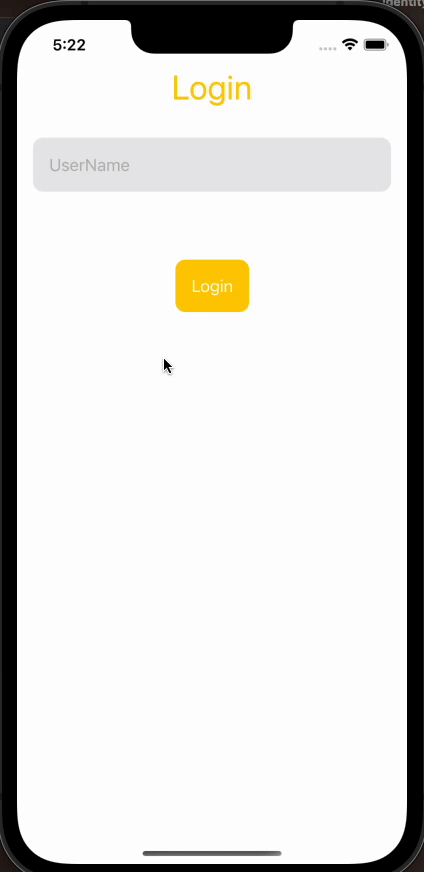
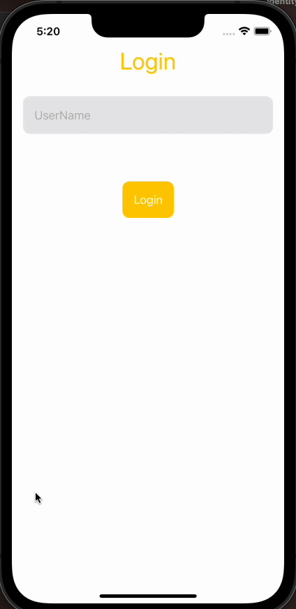

# SwiftUI SideMenu Master Example

The Sidemenu feature allows you to implement a sidebar navigation menu in your iOS app, providing a convenient way for users to access various sections or functionalities of your application.

## Table of Contents 

- [Demo](#demo)
- [Features](#features)
- [Installation](#installation)
- [Usage](#usage)
- [Contributing](#contributing)
- [Need Help / Support?](#need-help)
- [Collection of Components](#collection-of-Components)
- [License](#license)
- [Acknowledgements](#acknowledgements)
- [Keywords](#keywords)

# Demo 📱





# Features 🥳

* Demo has SideMenu feature
* Manage proper navigation by using navigation stack
* Fully customization available.
* Demo has complete flow with login and home view page.
* Minimum iOS Target 16.0

# Installation 💾

    * Clone the repository.
    * Open the project in Xcode.
    * Build and run the project.

# Usage & Integration 👩🏾‍🔬

To add the Sidemenu feature to your own SwiftUI project, follow the steps below:

** Create your new SwiftUI project with main app content view.  
** Create a new SwiftUI View that will represent the contents of the sidemenu that may be your root view or other view. And also can create other view to redirect from side menu list options.
** Drag and drop folder name as `SideMenuSources` as helper source of sidemenu into your project.

### Put the code for your side menu content view:
Here given the name of side menu content view as `HomeSideMenuView`. which is the initialisaton of side menu with options list. And `WliSideMenuView` is the struct of side menu. which have multiple parameters with default values and can provide your own values data as your need.

```swift
 struct HomeSideMenuView: View {
    @State var isMenuOpen: Bool = false
    let tabs = [MenuTabModel(title: "Home", imageName: "house"), MenuTabModel( title: "Settings", imageName: "gear")]
    @State var selectedTab: MenuTabModel = MenuTabModel(title: "Home", imageName: "house")
    @State var contentbgColor = Color.white
    @StateObject var viewModel: HomeSideMenuViewModel
    
    var body: some View {
        content()
            .navigationBarBackButtonHidden()
    }
    @ViewBuilder private func content() -> some View {
        ZStack {
            WliSideMenuView(
                isMenuOpen: $isMenuOpen,
                tabs: tabs, // add your [MenuTabModel]
                selectedTab: $selectedTab, //initial selectedTab
                contenViewtbgColor: $contentbgColor,     //acces view placeholder background
                bgImage: "",     //add your background image! Default value is airplane
                selectionColor: .yellow,
                blurRadius: 32,            // add blur radius for image default value is 32
                enable3D: true, //enable/disable 3D effect
                bgColor: .white  // set bg color of side menu
            ) {
                if selectedTab.title == "Home" {
                    SMHomeView(isMenuOpen: $isMenuOpen, backColor: $contentbgColor, viewModel: viewModel)
                } else if selectedTab.title == "Settings" {
                    SMSettingView(isMenuOpen: $isMenuOpen, backColor: $contentbgColor, viewModel: viewModel)
                }
            }
        }
    }
}

```
** I have added here two separate side menu options list view for example as `SMHomeView` and `SMSettingView` which use as content view for side menu list. That have own imlementation as per needs.

```swift

struct SMHomeView: View {
    @Binding var isMenuOpen: Bool
    @Binding var backColor: Color
    @StateObject var viewModel: HomeSideMenuViewModel
    let holidays = ["New Year's Day", "Valentine's Day", "Easter", "Christmas"]
    
    var body: some View {
        ZStack {//Your content is here
            backColor.ignoresSafeArea().cornerRadius(isMenuOpen ? 12:0)
            VStack {
                HStack {
                    Button(action: { isMenuOpen.toggle() }) {
                        Image(systemName: "line.3.horizontal").font(.title).foregroundColor(.black)
                    }.padding(.top, 0).padding(.leading, 12).frame(maxWidth: .infinity, alignment: .leading)
                    Spacer()
                }.background(Color.white)
                VStack(alignment: .leading) {
                    ScrollView {
                            ForEach(holidays, id: \.self) { holiday in
                                Text(holiday).foregroundColor(.black).padding()
                                Divider()
                            }
                    }
                }
            }
        }.onAppear {
            backColor = .white
        }
    }
}
 
```
Like this can implement your list option view as per your need. eg: `SMHomeView`
** Now can build and run the app.

# Contributing

- Created something awesome, made this code better, added some functionality, or whatever (this is the hardest part).
- [Fork it](http://help.github.com/forking/).
- Create new branch to contribute your changes.
- Commit all your changes to your branch.
- Submit a [pull request](http://help.github.com/pull-requests/).


# Need Help? 

We also provide a free, basic support for all users who want to use this coordinator master demo in project. In case you want to customize this demo input to suit your development needs, then feel free to contact our [iOS SwiftUI Developers](https://www.weblineindia.com/hire-ios-app-developers.html).

# Collection of Components

 We have built many other components and free resources for software development in various programming languages. Kindly click here to view our [Free Resources for Software Development.](https://www.weblineindia.com/software-development-resources.html)
 
# Changelog

 Detailed changes for each release are documented in [CHANGELOG](./CHANGELOG).

# License 📃

This project is licensed under the MIT License. Feel free to use, modify, and distribute the code as permitted by the license.

# Acknowledgements

This app was created using SwiftUI and leverages various libraries and resources. We would like to acknowledge and express our gratitude to the following:
* SwiftUI: Apple's declarative framework for building user interfaces.
* Xcode: Integrated development environment (IDE) provided by Apple.
* Open-source libraries: Various open-source libraries and frameworks used in the project.
* Community contributors: Contributors who have provided support, bug fixes, and enhancements.

# Keywords

SideMenu Master, SwiftUI, SideMenu-ViewModel Pattern, SideBar Patten, SideMenu Drawer, Navigation Stack, SideBar Reusable Component, SwiftUI SideBar, Swift5, iOS 16, WeblineIndia
